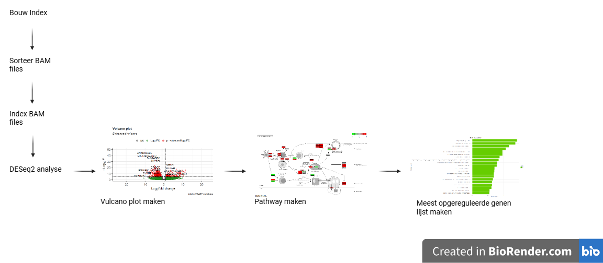

# Welke genen zijn meest betrokken bij het ontstaan bij Reumatoïde arteritis volgens de aangeleverde dataset

### Inleiding

Reumatoïde artritis (RA) is een chronische gewrichtsaandoening die veel uitdagingen met zich meebrengt vanwege de mogelijkheid om onomkeerbare gewrichtsschade en invaliditeit te veroorzaken. [Smolen, J. S., Aletaha, D., & McInnes, I. B. (2016).](bronnen/pubmed-27156434.txt) Het treft voornamelijk vrouwen, rokers en mensen bij wie het in de familie zit. Methotrexate is de eerste stap in het behandelen van RA. [Wasserman A. M. (2011).](bronnen/pubmed-22150658.txt)RA treft ongeveer 1% van de bevolking en heeft niet alleen gevolgen voor de kwaliteit van leven van patiënten maar legt ook een aanzienlijke last op de gezondheidszorg. [Ngian G. S. (2010).](bronnen/pubmed-20877764.txt) Vroege diagnose en een snelle gerichte behandeling zijn cruciaal voor het verbeteren van de resultaten op lange termijn, vooral bij personen met risicofactoren zoals vroege gewrichtsschade. Ondanks de vooruitgang in de behandeling is er nog steeds niet een behandeling die de ziekte stopt. In dit onderzoek wordt er gekeken naar patienten met en zonder RA, doormiddel van de up- en down gereguleerde genen te vergelijken aan de hand van de expressie. Dus de vraag is: Welke genen zijn betrokken bij RA. De deelvraag is: Welke biologiese processen zijn het sterkst opgeruguleerd en hoe kan dat?

### Methode

Om te kijken welke genen er worden gebruit bij RA zijn de genen met R geanaliseerd. De materialen zijn afkomstig van uit de synofium van 4 patienten met RA en 4 patienten zonder RA [link](bronnen/Patienten). Het was bevestigd met degene die autoantistoffen hebben voor CCP. Er een index gemaakt en de monsters ingeladen en gealined van het humaan genoom [link](https://www.ncbi.nlm.nih.gov/datasets/genome/GCF_000001405.40/). De gemaakte bestanden werden daarna gesorteerd, er werd daarna een DESeq data set aangemaakt. Daarna werd er een vulcano plot gemaakt. Daarna werd er een KEGG pathway (versie 1.66.0) gemaakt met behulp van ggplot2 (versie 3.5.2) voor de opregulaatie(Figuur 1). 
 

##### Figuur 1: Flowshema van data-analyse in R.

### Resultaten
Om te kijken welke genen opgereguleerd en downgereguleerd zijn is er een vulcano plot gemaakt (Figuur 2). In het vulcano plot is the zien dat er bepaalde genen meer of minder expressie hebben. Het gen ANKRD30BL in sterk gedownreguleerd. Voor de opgereguleerde genen is het SRGN.

 
#### Figuur 2: Rood is signifikant en biologish relefant en groen is signifikant en biologish relefant en grijs is geen van beide.

Om te kijken welke van welke genen zijn op- en downgereguleerd werden deze vergeleken met de RA pathway(Figuur 3), zoals CD80/86 en MHC-klasse 2.
 
#### Figuur 3: Rood is upgereguleerd en groen is downgereguleerd en grijs is geen informatie over.  

Om te kijken welke pathways er betrokken zijn bij opgereguleerde genen is er een pathway analyse gemaakt. Aan de hand van deze afbeelding (figuur 4) is te zien dat immune respone het strekst is opgereguleerd.

#### Figuur 4: Opgereguleerde genen van mensen met RA.

### Conclusie
In dit onderzoek is er gekeken naar het genoom van mensen met en zonder reuma. Dit onderzoek geeft een beeld over opgereguleerde en downgereguleerde genen. Om te bepalen welke genen betrokken bij RA moet de meer onderzoek gedaan worden omdat er nu heel veel genen betrokken zijn. Het is best logish dat immune respone het meest is opgereguleerd aangezien dit het meest te maken heeft met het aantasten van de gewrichten [(D'Orazio, A., 2024)](bronnen/pubmed-39315569.txt) Het opgereguleerde gen SRGN is betrokken bij de immuunreactie en zorgt voor een onstekings reactie [Qian, (2024).](bronnen/pubmed-38287411.txt) Om een conclusie te trekken zal er meer onderzoek moeten worden gedaan met meer variatie in leeftijd en geslacht.  Dus als aanbeveling zou er een onderzoek gedaan moeten worden met meer variatie in leeftijd, geslacht en de genen die er bij betrokken zijn.
